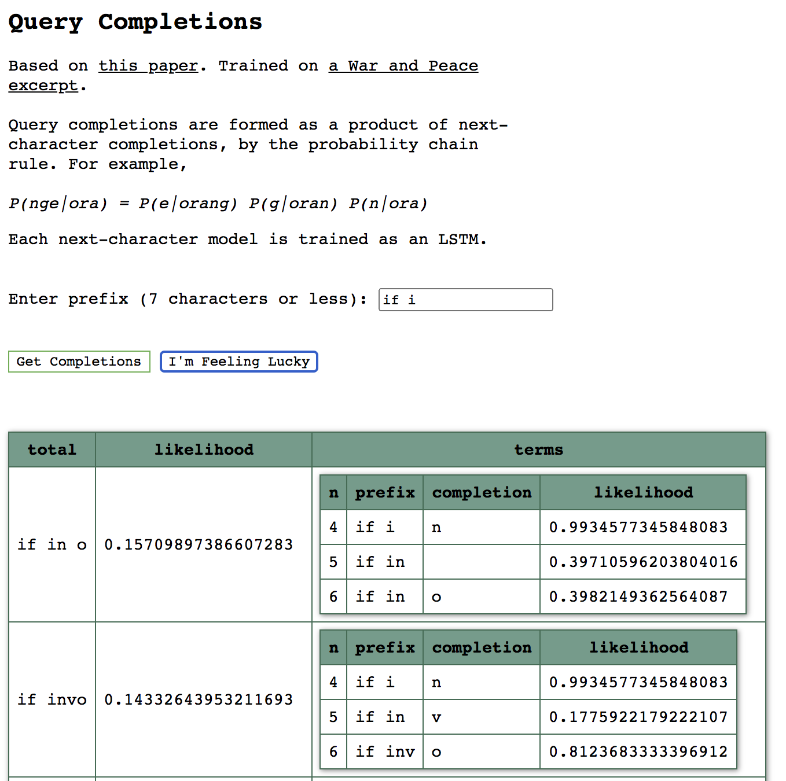
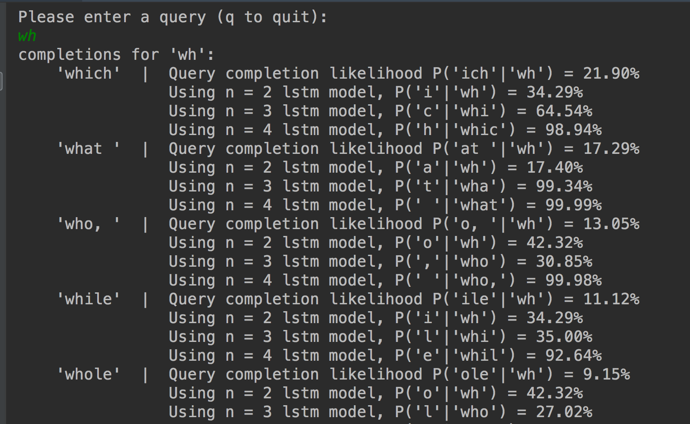

query completion
---
[Launch here](https://querycompletion.onrender.com/).

Accompanying [notes](https://www.redwrasse.io/notes/querycompletion).


Query completion as a product of next-character models. For example, completing ‘ora’ with ‘nge’ to make ‘orange’

**P(nge|ora) = P(e|orang) P(g|oran) P(n|ora)**

A contiguous sequence of trained n= models is needed; weights for some pre-trained models for n = ... are included.


### Run

Start with ui


``` 
python3 main.py
```


Or run from command line

``` 
python3 cmd_line.py
```

----


### References
* [Internal Notes](https://www.redwrasse.io/supplementals/querycompletion)
* [Realtime query completion via deep language models](https://sigir-ecom.github.io/ecom18Papers/paper24.pdf)
