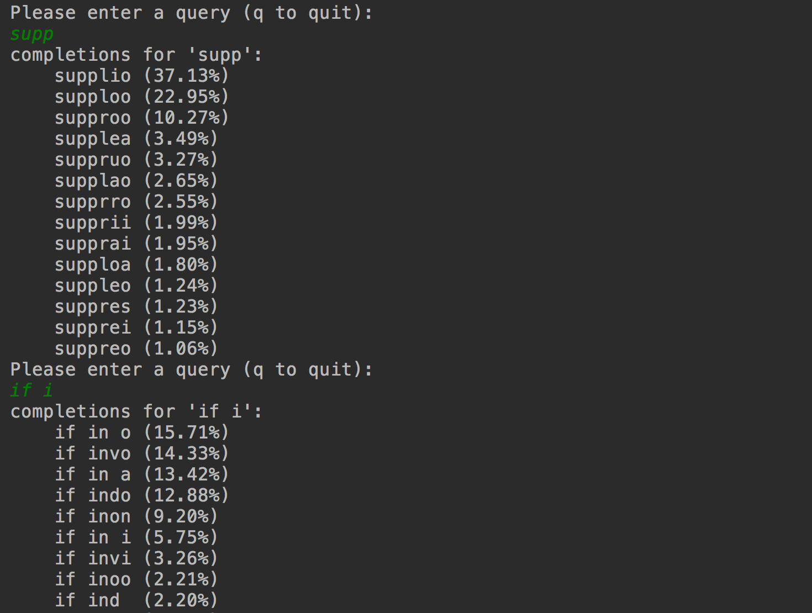

query completion
---

Query completion from a collection of next-character LSTM models.

### Background
See www.redwrasse.io/supplementals/querycompletion 
Query completion can be factored into a product of next-character models.


### Run

start command line prompt
``` 
python3 lstm_query_completion.py
```


